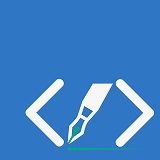
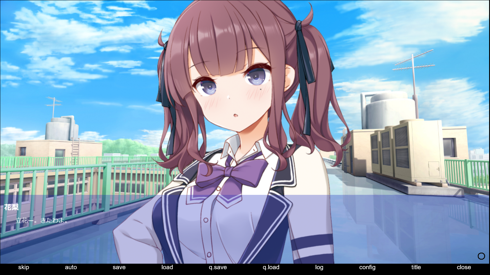

# webTaleKit



**[English](README_EN.md) | 日本語**

## 目次

- [概要](#概要)
- [デモ](#デモ)
- [環境構築手順](#環境構築手順)
- [動作確認手順](#動作確認手順)
- [Quick Start(デモゲームを弄ってみよう)](#quick-startデモゲームを弄ってみよう)
- [開発コマンド](#開発コマンド)
- [現在の状況](#現在の状況)
- [ロードマップ](#ロードマップ実装予定)
- [できること](#アルファ版01x-02xでできること)
- [制限事項](#アルファ版01x-02xの制限事項)

## 概要

TypeScript(JavaScript) ベースのビジュアルノベルゲームエンジンです。
UIをHTML・CSS・JavaScriptで柔軟に作成でき、シナリオをマークアップ言語とJavaScriptで制御できます。
自動スケーリング機能で、様々なウィンドウサイズに対応します。
VS Codeの拡張機能を用いたGUIエディタやREST API呼び出しによる生成AI連携の追加を提供予定です。

### 特徴

- 🎮 **柔軟なUI作成**: HTML・CSS・JavaScriptで自由にUIをデザイン
- 📝 **直感的なシナリオ記述**: マークアップ言語とJavaScriptでシナリオを制御
- 🔄 **自動スケーリング**: 様々なウィンドウサイズに自動対応
- 🎨 **豊富な画像処理**: フィルター・アニメーション機能を搭載
- 🔊 **サウンド対応**: BGM・SE・ボイス再生に対応
- 🛠️ **TypeScript対応**: TypeScriptでの開発をサポート
- 🤖 **AI連携**: REST API呼び出しによる生成AI連携（予定）

## デモ

Firefoxでも、Chromeでも、Edgeでも、好きなブラウザを使いたまえ・・・!
<https://test-game-chi.vercel.app/>


## 環境構築手順

1. Git が必要です。
   - **インストール確認:** `git --version` でバージョンが表示されれば OK
   - Windowsの場合は、Git公式サイト (<https://git-scm.com/>) からインストールしてください。
   - Macの場合は、`brew install git` を実行してインストールしてください。
   - Linuxの場合は、以下のコマンドを実行してインストールしてください。

    ```bash
    sudo apt-get update
    sudo apt-get install git
    ```

2. Node.js(20以降)が必要です。(nvm等お好みの方法がある場合は、そちらでも構いません)
   - **インストール確認:** `node --version` でv20以上のバージョンが表示されれば OK
   - Windowsの場合は、Node.js公式サイト (<https://nodejs.org/>) からインストールしてください。
   - Macの場合は、`brew install node` を実行してインストールしてください。
   - Linuxの場合は、以下のコマンドを実行して、インストールしてください。

    ```bash
    curl -fsSL https://deb.nodesource.com/setup_lts.x | sudo -E bash -
    sudo apt-get install -y nodejs
    ```

3. 以下のコマンドを実行してください

    ``` bash
    npm create tale-game your-game-title
    cd your-game-title
    npm run play
    ```

デモゲームが起動すれば、構築は完了です。

## 動作確認手順

以下のコマンドを実行してください。

```bash
git clone https://github.com/EndoHizumi/testGame.git
cd testGame
npm install
npm run play
```

## Quick Start(デモゲームを弄ってみよう)

このセクションでは、プログラミングの知識がなくても簡単にゲームをカスタマイズできる方法を説明します。

### 画像を差し替える(簡単なカスタマイズ)

**手順:** 既存の画像ファイルを新しい画像で置き換える(ファイル名は同じにしてください)

#### キャラクターや背景を変える

- **キャラを変える場合**
  - `./src/resource/chara/guide.png` を新しいキャラ画像で上書きしてください(ファイル名は `guide.png` のまま)
- **背景画像を変える**
  - `./src/resource/background/title_bg.png` を新しい背景画像で上書きしてください(ファイル名は `title_bg.png` のまま)
- **BGMを変える**
  - `./src/resource/bgm/title_theme.mp3` を新しい音楽ファイルで上書きしてください(ファイル名は `title_theme.mp3` のまま)

#### ボタンの見た目を変える

- **選択肢の画像を変える**
  - `./src/resource/system/systemPicture/02_button/button.png`(通常時) - ファイル名は `button.png` のまま上書き
  - `./src/resource/system/systemPicture/02_button/button2.png`(マウスを乗せた時) - ファイル名は `button2.png` のまま上書き
  - `./src/resource/system/systemPicture/02_button/button3.png`(クリック時) - ファイル名は `button3.png` のまま上書き

**パス表記について:**

- `./` は「現在のプロジェクトフォルダから」という意味です
- パス区切り文字は `/` (スラッシュ) を使用しています
- **Windowsをお使いの方:** `\` (バックスラッシュ) でも動作しますが、上記の `/` 形式を推奨します

### シナリオファイルを編集する(テキストの変更)

シナリオファイル(`.scene`ファイル)をテキストエディタで開いて、以下の方法で内容を変更できます:

#### 基本的な要素の追加

- **キャラを増やす**
  1. `./src/resource/character` フォルダに新しいキャラ画像を保存
  2. シナリオファイルで `<show src="キャラ画像のファイル名"></show>` を記述
- **セリフを増やす**
  - `<say name="キャラの名前">ここにセリフを入力</say>` を記述
- **地の文(ナレーション)を増やす**
  - `<text>ここに地の文を入力</text>` を記述

**初心者の方へ:** まずは既存のテキストを変更することから始めることをお勧めします。

#### 選択肢を追加・変更する

選択肢はプレイヤーがゲームの進行を選ぶ重要な要素です。シナリオファイル内の `<choice>` タグを編集することで変更できます。

**基本的な選択肢の書き方:**

``` html
<item label='選択肢の文言'>
    <text>選択後に表示される文章</text>
</item>
```

**実用的な例:**

```html
<choice prompt="ゲームを始めますか?">
  <item label="はい">
      <jump index="5" />
  </item>
  <item label="いいえ">
      <jump index="16" />
  </item>
  <item label='ちょっと待ってくれ'>
    <text>承知しました。</text>
     <jump index="1" />
  </item>
</choice>
```

## 開発コマンド

### ビルドと開発

- `npm run build` - TypeScriptをJavaScriptにコンパイルし、配布ファイルを準備
- `npm run dev` - プロジェクトをビルドし、exampleフォルダで開発サーバーを起動
- `npm run lint` - ESLintでコード品質をチェック
- `npm run test` - Jestでテストを実行

### CLIツール

- `wtc` - WebTaleScriptパーサーCLI (`parser/cli.js` から利用可能)
- 使用方法: `wtc <scene-file> [output-directory]` で `.scene` ファイルを `.js/.ts` ファイルに変換

### ドキュメント

- `npm run docs:dev` - VitePressドキュメントサーバーを起動
- `npm run docs:build` - ドキュメントをビルド
- `npm run docs:preview` - ビルドしたドキュメントをプレビュー

## 現在の状況

webTaleKitは、現在アルファ版です。

開発進捗は、[@endo_hizumi](https://x.com/endo_hizumi) で行っております。
実装予定の項目については、こちらの[Trello](https://trello.com/b/qYNGh7MY)からも確認できます。

デモをプレイした感想・WebTaleKitを使って気になったことなど、意見・感想はこちらで受け付けています!
[https://forms.gle/uejQwvwAb99wcJht7](https://forms.gle/uejQwvwAb99wcJht7)

検索Hashtag: #webTalekit

## ロードマップ(実装予定)

| バージョン | コードネーム | codeName | 内容
| :--- | :--- | :--- | :---
| 0.1.0 | 初音| HATUNE | 初期リリース
| 0.2.0 | 礎 | ISHIZUE | 基本機能アップデート<br>0.2.12〜<br>ダイアログ表示タグの追加<br>engineConfig反映バグの修正<br>未定義タグがある場合、undefineを呼び出すバグの修正<br>文字列以外を囲むとこける問題の修正<br>リンク切れでこける問題の修正<br>メッセージウィンドウオーバーフローの修正<br>if属性の実装<br>for属性の実装<br>既読管理の追加
| 0.3.0 | 舞踊 | BUYO | トランジション・アニメーション関連のアップデート<br>テキストスピードの調整タグの追加<br>テキスト表示フォントサイズの変更<br>Webフォントのサポート(フォント変更設定の追加)<br>動画再生のサポート<br>子要素でフィルター・アニメーション設定
| 0.4.0 | 狭間 | HAZAMA | Vue.jsやReact、SvelteなどのUIフレームワークとの連携追加のアップデート
| 0.5.0 | 操手 | AYATURI |  ゲームパッドのサポート追加<br>キーコンフィグの追加<br>VOICEBOX APIの対応<br>npm run recの追加
| 0.6.0 | 絡繰 | KARAKURI | wtsLinterの追加<br>VSCodeとの連携追加<br>wst2htmlの追加<br>プラグイン機能の追加<br>クロスプラットホームへのビルド追加
| 0.7.0 | 綴り | TUDURI |  GUIエディタの追加
| 0.8.0 | 迅雷 | JINRAI |  パフォーマンスアップデート
| 0.9.0 | 出島 | DEJIMA |  KAGタグコンバータの追加
| 1.0.0 | 暁月 | AKATUKI |  メジャーアップデート

## アルファ版(0.1.x-0.2.x)で、できること

### テキスト表示

- 地の文の表示
- キャラクターのセリフの表示・ボイスの再生
- 定義した変数の表示

### キャラクター・画像操作

- キャラクターの画像の表示・位置変更・アニメーション
- その他の画像の画像の表示・位置変更・アニメーション
- キャラクターの複数表示・位置変更・アニメーション
- CGの表示・変更
- 背景画像の表示・変更

### 画像処理

- 画像のフィルター操作
  - モノクロ化
  - セピア化
  - 透明度の変更
  - サイズの変更

### ユーザーインタラクション

- 選択肢の表示
- 選択肢の画像の変更
  - 通常時
  - マウスオーバー
  - 選択時
- Ctrlキーでの強制スキップ
- Enterキーで全文表示

### シナリオ制御

- 表示する文章・画像の条件分岐
- セリフのジャンプ
- シナリオ(シーン)の切り替え

### 音声

- BGMの再生・停止
- SEの再生・停止

### システム設定・UI

- HTMLで作った画面の表示
- 解像度の設定変更

### プログラミング連携

- JavaScript連携
  - メソッドの呼び出し
  - 式の実行
  - 変数の定義・値の変更
- JavaScript側での背景画像の変更
- TypeScript連携
- REST API呼び出し(レスポンスの表示)

## アルファ版(0.1.x-0.2.x)の制限事項

### ビルド・プラットフォーム

- Desktopアプリケーションへのビルド
- Android(iOS)向けのビルド

### ユーザーインターフェース (UI)

- 画面各種のボタン
- セーブファイルの一覧の取得

### キャラクター操作

- sayタグの以下の機能
  - キャラが表示されていないときは、表示する

### セーブ&ロード

- セーブ&ロード機能

### 視覚効果

- showタグ / hideタグの以下の機能
  - 子要素でフィルター指定
  - 子要素でアニメーション指定
  - スラッシュで区切ってリソース種類を指定
- quakeタグ(画面を揺らす)
- maskタグ(画面の暗転)

### 音声

- soundタグの以下の機能
  - pause
  - setVolume
  - getVolume
  - bgmエイリアス
  - voiceエイリアス
  - seエイリアス

### リソース管理

- JavaScriptでのリソースの動的定義

### 設定・最適化

- ゲーム設定ファイルの反映
- 画面用HTMLのcss・jsのインライン化・minify化

## ライセンス

MIT License

## クレジット

### アイコン素材

- <https://www.silhouette-illust.com/>

### カラーコード

- 青: #3178C6 (TypeScript Blue)
- 緑: #02a889 (WebTaleKit Green)
- 白: #f8f8f8 (White Smoke)
