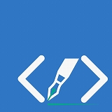
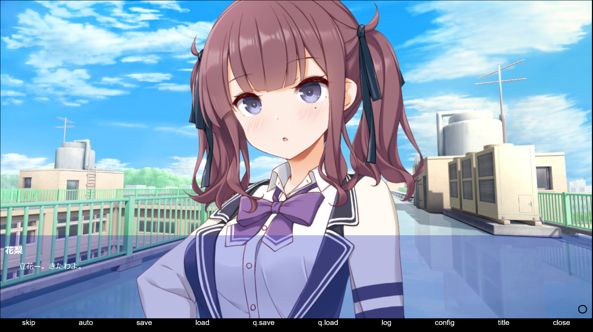

# webTaleKit



**[English](README_EN.md) | 日本語**

## 目次

- [概要](#概要)
- [デモ](#デモ)
- [ドキュメント](#ドキュメント)
- [環境構築手順](#環境構築手順)
- [動作確認手順](#動作確認手順)
- [Quick Start(デモゲームを弄ってみよう)](#quick-startデモゲームを弄ってみよう)
- [🤖 LLMと会話する](#-llmと会話する)
- [開発コマンド](#開発コマンド)
- [シナリオ検証API](#シナリオ検証api)
- [現在の状況](#現在の状況)
- [ロードマップ](#ロードマップ実装予定)
- [できること](#アルファ版01x-02xでできること)
- [制限事項](#アルファ版01x-02xの制限事項)

## 概要

TypeScript(JavaScript) ベースのビジュアルノベルゲームエンジンです。

- **UIは普通のHTML・CSS・JavaScriptで作れます。** 独自のUI記法を覚える必要はありません。自動スケーリングで様々なウィンドウサイズに対応します。
- **シナリオはWebTaleScript(HTML風のマークアップ)で書き、TypeScript/JavaScriptで拡張できます。** シーンファイル内の `<script>` で定義した変数や関数を、シナリオからそのまま使えます。
- **シナリオからJSのメソッドやREST API(POSTを含む)を呼べます。** レスポンスは変数 `res` に入るので、LLMの応答をそのままキャラクターのセリフにできます([LLMと会話する](#-llmと会話する))。
- **Vue.jsでUIを作るサンプル([example-vue](example-vue/))があります。** `new Core({ customUI: true })` で標準UIを無効にし、EventBusのイベント(`text:show` / `choice:show` など)を購読して画面を描きます。EventBusはフレームワークに依存しないので、Reactなど他のフレームワークにも同じ方法で組み込めます。
- **AIコーディングエージェント向けの設定を同梱しています。** リポジトリ直下に `CLAUDE.md` / `copilot-instructions.md` / `.clinerules` があります。

### 特徴

- 🎮 **柔軟なUI作成**: HTML・CSS・JavaScriptで自由にUIをデザイン
- 📝 **直感的なシナリオ記述**: マークアップ言語とJavaScriptでシナリオを制御
- 🔄 **自動スケーリング**: 様々なウィンドウサイズに自動対応
- 🎨 **豊富な画像処理**: フィルター・アニメーション機能を搭載
- 🔊 **サウンド対応**: BGM・SE・ボイス再生に対応
- 🛠️ **TypeScript対応**: TypeScriptでの開発をサポート
- 🧩 **UIフレームワーク連携**: Vue.jsでUIを作るサンプル(example-vue)付き。`customUI: true` とEventBusで、React等にも同じ方法で組み込める
- 🤖 **LLM連携**: 全タグ共通のHTTP属性(`get` / `post` / `put` / `delete`)でLLMのAPIを呼び、応答をセリフとして表示
- 🧑‍💻 **AIコーディング対応**: Claude Code・GitHub Copilot・Cline向けの設定ファイルを同梱

## デモ

Firefoxでも、Chromeでも、Edgeでも、好きなブラウザを使いたまえ・・・!
<https://test-game-chi.vercel.app/>


## ドキュメント

📖 **オンラインドキュメント**: <https://endohizumi.github.io/webTaleKit/>

## 環境構築手順

1. Git が必要です。
   - **インストール確認:** `git --version` でバージョンが表示されれば OK
   - Windowsの場合は、Git公式サイト (<https://git-scm.com/>) からインストールしてください。
   - Macの場合は、`brew install git` を実行してインストールしてください。
   - Linuxの場合は、以下のコマンドを実行してインストールしてください。

    ```bash
    sudo apt-get update
    sudo apt-get install git
    ```

2. Node.js(20以降)が必要です。(nvm等お好みの方法がある場合は、そちらでも構いません)
   - **インストール確認:** `node --version` でv20以上のバージョンが表示されれば OK
   - Windowsの場合は、Node.js公式サイト (<https://nodejs.org/>) からインストールしてください。
   - Macの場合は、`brew install node` を実行してインストールしてください。
   - Linuxの場合は、以下のコマンドを実行して、インストールしてください。

    ```bash
    curl -fsSL https://deb.nodesource.com/setup_lts.x | sudo -E bash -
    sudo apt-get install -y nodejs
    ```

3. 以下のコマンドを実行してください

    ``` bash
    npm create tale-game your-game-title
    cd your-game-title
    npm run play
    ```

デモゲームが起動すれば、構築は完了です。

## 動作確認手順

以下のコマンドを実行してください。

```bash
git clone https://github.com/EndoHizumi/testGame.git
cd testGame
npm install
npm run play
```

## Quick Start(デモゲームを弄ってみよう)

このセクションでは、プログラミングの知識がなくても簡単にゲームをカスタマイズできる方法を説明します。

### 画像を差し替える(簡単なカスタマイズ)

**手順:** 既存の画像ファイルを新しい画像で置き換える(ファイル名は同じにしてください)

#### キャラクターや背景を変える

- **キャラを変える場合**
  - `./src/resource/chara/guide.png` を新しいキャラ画像で上書きしてください(ファイル名は `guide.png` のまま)
- **背景画像を変える**
  - `./src/resource/background/title_bg.png` を新しい背景画像で上書きしてください(ファイル名は `title_bg.png` のまま)
- **BGMを変える**
  - `./src/resource/bgm/title_theme.mp3` を新しい音楽ファイルで上書きしてください(ファイル名は `title_theme.mp3` のまま)

#### ボタンの見た目を変える

- **選択肢の画像を変える**
  - `./src/resource/system/systemPicture/02_button/button.png`(通常時) - ファイル名は `button.png` のまま上書き
  - `./src/resource/system/systemPicture/02_button/button2.png`(マウスを乗せた時) - ファイル名は `button2.png` のまま上書き
  - `./src/resource/system/systemPicture/02_button/button3.png`(クリック時) - ファイル名は `button3.png` のまま上書き

**パス表記について:**

- `./` は「現在のプロジェクトフォルダから」という意味です
- パス区切り文字は `/` (スラッシュ) を使用しています
- **Windowsをお使いの方:** `\` (バックスラッシュ) でも動作しますが、上記の `/` 形式を推奨します

### シナリオファイルを編集する(テキストの変更)

シナリオファイル(`.scene`ファイル)をテキストエディタで開いて、以下の方法で内容を変更できます:

#### 基本的な要素の追加

- **キャラを増やす**
  1. `./src/resource/character` フォルダに新しいキャラ画像を保存
  2. シナリオファイルで `<show src="キャラ画像のファイル名"></show>` を記述
- **セリフを増やす**
  - `<say name="キャラの名前">ここにセリフを入力</say>` を記述
- **地の文(ナレーション)を増やす**
  - `<text>ここに地の文を入力</text>` を記述

**初心者の方へ:** まずは既存のテキストを変更することから始めることをお勧めします。

#### 選択肢を追加・変更する

選択肢はプレイヤーがゲームの進行を選ぶ重要な要素です。シナリオファイル内の `<choice>` タグを編集することで変更できます。

**基本的な選択肢の書き方:**

``` html
<item label='選択肢の文言'>
    <text>選択後に表示される文章</text>
</item>
```

**実用的な例:**

```html
<choice prompt="ゲームを始めますか?">
  <item label="はい">
      <jump index="5" />
  </item>
  <item label="いいえ">
      <jump index="16" />
  </item>
  <item label='ちょっと待ってくれ'>
    <text>承知しました。</text>
     <jump index="1" />
  </item>
</choice>
```

## 🤖 LLMと会話する

どのタグにも `get` / `post` / `put` / `delete` 属性を付けてREST APIを呼び出せます。
レスポンスのJSONは変数 `res` に入り、`<then>` の中で `{{res.xxx}}` として表示できます。
これを使うと、LLMの応答をそのままキャラクターのセリフにできます。

```html
<scene>
  <scenario>
    <say name="案内人" post="http://localhost:3002/chat">
      <progress>考え中……</progress>
      <header>
        <Content-Type>application/json</Content-Type>
      </header>
      <data>
        <message>{{question}}</message>
      </data>
      <then>{{res.reply}}</then>
      <error>ごめんなさい、いまはうまく答えられません。</error>
    </say>
  </scenario>

  <script>
    export let question = 'このゲームの遊び方を教えて'
    // HTTPレスポンスが入る変数(リクエスト前に参照してもエラーにならないよう宣言しておく)
    export let res = null
  </script>
</scene>
```

- `<data>` の子要素は `{ "message": "…" }` というJSONに変換されて送信されます。値の中の `{{…}}` は送信前に展開されます。
- `<header>` の `Content-Type: application/json` は省略しないでください。省略するとヘッダーが付かず、下記の中継サーバーはリクエストをJSONとして読めません。
- レスポンスが2xxなら `<then>`、4xx/5xxのときや通信できなかったときは `<error>` の内容が表示されます。
- `{{ }}` の中身はJavaScriptの式として評価されるので、`{{res.a.b}}` のようなネストした参照や `{{res.items[0]}}` のような配列の添字も使えます。

### 中継サーバーを起動する

このリポジトリには、OpenAI互換API(`/chat/completions`)に中継するサンプルサーバー [server/chat.js](server/chat.js) が入っています。llama.cpp server・Ollama・LM Studio などのローカルLLMや、Gemini・OpenAIのOpenAI互換エンドポイントで使えます。受け取った `message` をLLMに渡し、`{ "reply": "…" }` を返します。

```bash
# ローカルLLM(APIキー不要)の例: llama.cpp server を 8082 番で起動しておく
#   llama-server -m your-model.gguf --port 8082
LLM_BASE_URL=http://localhost:8082/v1 LLM_MODEL=local-model npm run chat
```

> [!NOTE]
> llama.cpp server の既定ポート(8080)は、サンプルゲーム(`example`)の開発サーバーと同じです。
> 同時に動かすときは、上の例のようにLLM側を別のポートで起動し、`LLM_BASE_URL` をそれに合わせてください。

| 環境変数 | 既定値 | 説明 |
| :--- | :--- | :--- |
| `LLM_BASE_URL` | `http://localhost:8080/v1` | OpenAI互換APIのベースURL |
| `LLM_API_KEY` | (空) | APIキー。ローカルLLMなら不要 |
| `LLM_MODEL` | `local-model` | モデル名 |
| `SYSTEM_PROMPT` | 案内人としての短い指示 | システムプロンプト |
| `ALLOWED_ORIGIN` | `*` | CORSで許可するオリジン |
| `PORT` | `3002` | 待ち受けポート |

> [!WARNING]
> **APIキーをシナリオ(`.scene` ファイル)や `<header>` に書かないでください。**
> シナリオはブラウザに配信されるJavaScriptに変換されるため、プレイヤーが誰でも読めます。
> APIキーは中継サーバーの環境変数(`LLM_API_KEY`)に置き、ブラウザからは中継サーバーだけを呼び出してください。
> 公開するときは `ALLOWED_ORIGIN` をゲームのURLに絞ってください。

## 開発コマンド

### ビルドと開発

- `npm run build` - TypeScriptをJavaScriptにコンパイルし、配布ファイルを準備
- `npm run dev` - プロジェクトをビルドし、exampleフォルダで開発サーバーを起動
- `npm run lint` - ESLintでコード品質をチェック
- `npm run test` - Jestでテストを実行

### CLIツール

- `wtc` - WebTaleScriptパーサーCLI (`parser/cli.js` から利用可能)
- 使用方法: `wtc <scene-file> [output-directory]` で `.scene` ファイルを `.js/.ts` ファイルに変換

### ドキュメント

- `npm run docs:dev` - VitePressドキュメントサーバーを起動
- `npm run docs:build` - ドキュメントをビルド
- `npm run docs:preview` - ビルドしたドキュメントをプレビュー

## シナリオ検証API

WebTaleKit には、シナリオ配列を検証しつつ、HTML風の文字列を非破壊でサニタイズできる公開APIがあります。

- `validateScenarioObjects` - 検証結果とサニタイズ済みシナリオを返します
- `formatValidationOutput` - エラーと警告を表示用文字列へ整形します
- `createScenarioValidationError` - 検証結果から Error を生成します
- `assertScenarioValidation` - エラーがある場合に例外を送出します
- `reportScenarioValidation` - logger 経由で警告とエラーを出力します

これらのAPIは、エンジン実行時に自動で強制適用されません。シナリオの読み込み時、エディタ連携時、独自ビルド処理時などに、利用者が必要に応じて呼び出す想定です。

```ts
import {
  assertScenarioValidation,
  reportScenarioValidation,
  validateScenarioObjects,
} from './src/utils/validateScenario'

const result = validateScenarioObjects(scenarioObjects, commandList)

await reportScenarioValidation(result, 'Scene import')
assertScenarioValidation(result, 'Scene import')

const safeScenario = result.sanitizedScenario
```

`sanitizedScenario` は元の入力配列を破壊せずに返されます。`sanitized` が `true` の場合は、HTML風の文字列がエスケープされています。

## 現在の状況

webTaleKitは、現在アルファ版です。

開発進捗は、[@endo_hizumi](https://x.com/endo_hizumi) で行っております。
実装予定の項目については、こちらの[Trello](https://trello.com/b/qYNGh7MY)からも確認できます。

デモをプレイした感想・WebTaleKitを使って気になったことなど、意見・感想はこちらで受け付けています!
[https://forms.gle/uejQwvwAb99wcJht7](https://forms.gle/uejQwvwAb99wcJht7)

検索Hashtag: #webTalekit

## ロードマップ(実装予定)

| バージョン | コードネーム | codeName | 内容
| :--- | :--- | :--- | :---
| 0.1.0 | 初音| HATUNE | 初期リリース
| 0.2.0 | 礎 | ISHIZUE | 基本機能アップデート<br>0.2.12〜<br>ダイアログ表示タグの追加<br>engineConfig反映バグの修正<br>未定義タグがある場合、undefineを呼び出すバグの修正<br>文字列以外を囲むとこける問題の修正<br>リンク切れでこける問題の修正<br>メッセージウィンドウオーバーフローの修正<br>if属性の実装<br>for属性の実装<br>既読管理の追加
| 0.3.0 | 舞踊 | BUYO | トランジション・アニメーション関連のアップデート<br>テキストスピードの調整タグの追加<br>テキスト表示フォントサイズの変更<br>Webフォントのサポート(フォント変更設定の追加)<br>動画再生のサポート<br>子要素でフィルター・アニメーション設定
| 0.4.0 | 狭間 | HAZAMA | Vue.js・React・Svelte向け公式アダプタのパッケージ化<br>(`customUI: true` とEventBusによる組み込み自体は現在も可能。[example-vue](example-vue/)参照)
| 0.5.0 | 操手 | AYATURI |  ゲームパッドのサポート追加<br>キーコンフィグの追加<br>VOICEBOX APIの対応<br>npm run recの追加
| 0.6.0 | 絡繰 | KARAKURI | wtsLinterの追加<br>VSCodeとの連携追加<br>wst2htmlの追加<br>プラグイン機能の追加<br>クロスプラットホームへのビルド追加
| 0.7.0 | 綴り | TUDURI |  GUIエディタの追加
| 0.8.0 | 迅雷 | JINRAI |  パフォーマンスアップデート
| 0.9.0 | 出島 | DEJIMA |  KAGタグコンバータの追加
| 1.0.0 | 暁月 | AKATUKI |  メジャーアップデート

## アルファ版(0.1.x-0.2.x)で、できること

### テキスト表示

- 地の文の表示
- キャラクターのセリフの表示・ボイスの再生
- 定義した変数の表示

### キャラクター・画像操作

- キャラクターの画像の表示・位置変更・アニメーション
- その他の画像の画像の表示・位置変更・アニメーション
- キャラクターの複数表示・位置変更・アニメーション
- CGの表示・変更
- 背景画像の表示・変更

### 画像処理

- 画像のフィルター操作
  - モノクロ化
  - セピア化
  - 透明度の変更
  - サイズの変更

### ユーザーインタラクション

- 選択肢の表示
- 選択肢の画像の変更
  - 通常時
  - マウスオーバー
  - 選択時
- Ctrlキーでの強制スキップ
- Enterキーで全文表示

### シナリオ制御

- 表示する文章・画像の条件分岐
- セリフのジャンプ
- シナリオ(シーン)の切り替え

### 音声

- BGMの再生・停止
- SEの再生・停止

### セーブ&ロード

- セーブ機能
- ロード機能

### システム設定・UI

- HTMLで作った画面の表示
- 解像度の設定変更

### プログラミング連携

- JavaScript連携
  - メソッドの呼び出し
  - 式の実行
  - 変数の定義・値の変更
- JavaScript側での背景画像の変更
- TypeScript連携
- REST API呼び出し(レスポンスの表示)

## アルファ版(0.1.x-0.2.x)の制限事項

### ビルド・プラットフォーム

- Desktopアプリケーションへのビルド
- Android(iOS)向けのビルド

### ユーザーインターフェース (UI)

- 画面各種のボタン
- セーブファイルの一覧の取得

### キャラクター操作

- sayタグの以下の機能
  - キャラが表示されていないときは、表示する

### 視覚効果

- showタグ / hideタグの以下の機能
  - 子要素でフィルター指定
  - 子要素でアニメーション指定
  - スラッシュで区切ってリソース種類を指定
- quakeタグ(画面を揺らす)
- maskタグ(画面の暗転)

### 音声

- soundタグの以下の機能
  - pause
  - setVolume
  - getVolume
  - bgmエイリアス
  - voiceエイリアス
  - seエイリアス

### リソース管理

- JavaScriptでのリソースの動的定義

### 設定・最適化

- ゲーム設定ファイルの反映
- 画面用HTMLのcss・jsのインライン化・minify化

## ライセンス

MIT License

## クレジット

### アイコン素材

- <https://www.silhouette-illust.com/>

### カラーコード

- 青: #3178C6 (TypeScript Blue)
- 緑: #02a889 (WebTaleKit Green)
- 白: #f8f8f8 (White Smoke)
